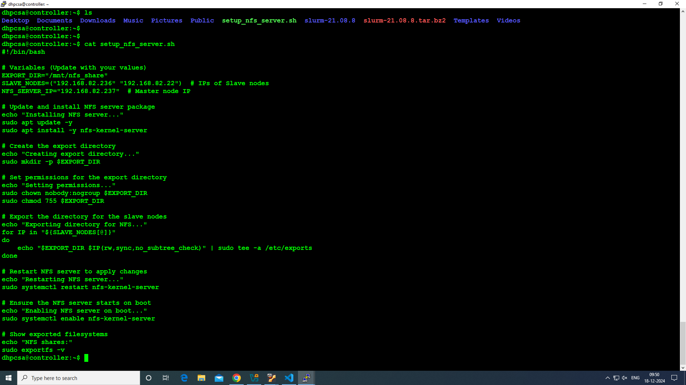
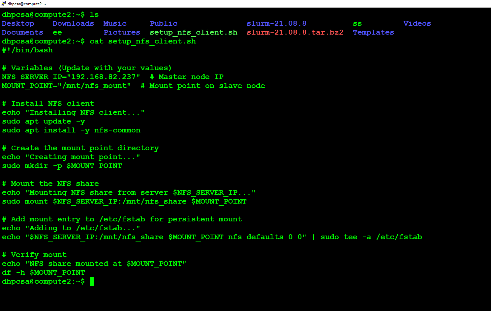
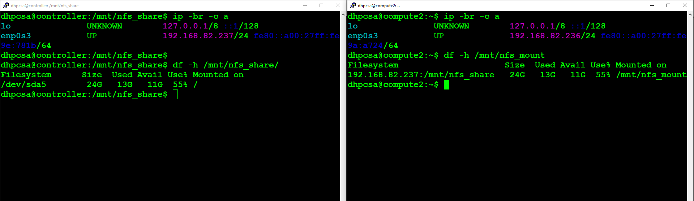
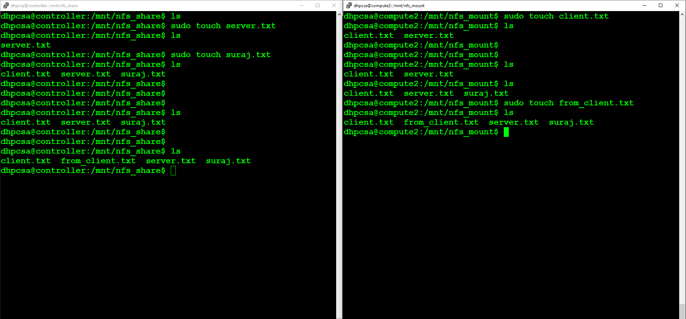

# NFS (Network File System) Setup  Using Script 

*NFS is a distributed file system protocol that allows a user on a client computer to access files over a network as if they were on the local storage. This script automates the setup of an NFS server (master node) and NFS clients (compute nodes) in a distributed computing environment.*


## NFS Master (Server) Role:

#### The master is responsible for hosting the shared directories (/storage/data and /storage/scripts) that are accessible to client machines.

### Key tasks include:
- Installing the necessary server-side tools (nfs-kernel-server).
-  Configuring export rules in /etc/exports to define shared directories and access permissions.
-  Restarting and enabling the NFS service to apply changes.


## NFS Compute (Client) Role:

#### The compute node accesses the shared directories hosted on the NFS master.

### Key tasks include:
-  Installing the client-side tools (nfs-utils).
-  Mounting the shared directories to local paths (/storage/data and /storage/scripts).
-  Configuring fstab for persistent mounting across reboots.

## Security and Permissions:

-  Proper access controls are crucial. The script uses no_root_squash for testing and development, but this should be avoided in production.
-  Permissions are carefully assigned using chmod 755 instead of 777 to restrict access.


<br>


### Why Use Scripts for NFS Setup?
*Setting up an NFS server and configuring clients involves multiple steps, including installing packages, creating directories, configuring permissions, and making persistent changes. By using a script:*

  - Consistency: Ensures the same commands are executed correctly every time.
  - Efficiency: Reduces manual effort and the risk of human errors.
  - Reusability: The scripts can be reused on different nodes or adapted for similar setups.
  - Scalability: Simplifies configuration when managing multiple nodes.

      *With these scripts, you don’t need to execute commands one at a time; running the script automates the entire process on both the master and slave nodes.*


<br>
<br>


## *Master Node: NFS Server Setup*
  *This script sets up the master node as the NFS server and shares a directory accessible to specific slave nodes.*

  - **Save the script as setup_nfs_server.sh:**


    
```yml

#!/bin/bash

# Variables
EXPORT_DIR="/mnt/nfs_share"
SLAVE_NODES=("192.168.1.101" "192.168.1.102") # Replace with actual slave IPs

# Install required packages
echo "Installing NFS server..."
sudo apt update -y
sudo apt install -y nfs-kernel-server

# Create and configure the shared directory
echo "Setting up shared directory..."
sudo mkdir -p $EXPORT_DIR
sudo chown nobody:nogroup $EXPORT_DIR
sudo chmod 755 $EXPORT_DIR

# Add export rules for the specified slave nodes
echo "Configuring export rules..."
for IP in "${SLAVE_NODES[@]}"; do
    echo "$EXPORT_DIR $IP(rw,sync,no_subtree_check)" | sudo tee -a /etc/exports
done

# Restart and enable NFS server
echo "Restarting NFS server..."
sudo systemctl restart nfs-kernel-server
sudo systemctl enable nfs-kernel-server

# Verify exports
sudo exportfs -v

echo "NFS server setup completed!"


```


  - Run the script:

```yml
chmod +x setup_nfs_server.sh

sudo ./setup_nfs_server.sh
```


### Master Node: NFS Server Script  Explanation
1. sudo apt update -y
    - Updates the package list to ensure the latest versions of software can be installed.

2. sudo apt install -y nfs-kernel-server
    - Installs the NFS server software required to host shared directories.

3. sudo mkdir -p $EXPORT_DIR
    - Creates the directory to be shared via NFS. The -p option ensures the parent directories are created if they don't exist.

4. sudo chown nobody:nogroup $EXPORT_DIR
    - Sets ownership of the shared directory to a neutral user (nobody) and group (nogroup), ensuring it's accessible to clients.

5. sudo chmod 755 $EXPORT_DIR
    - Sets permissions for the directory to make it readable, writable, and executable by the owner, and readable/executable by others.

6. echo "$EXPORT_DIR $IP(rw,sync,no_subtree_check)" | sudo tee -a /etc/exports
    - Appends export rules to /etc/exports, specifying:

      - rw: Read-write access.
      - sync: Writes to the shared directory are synced immediately.
      - no_subtree_check: Disables subtree checking for performance.

7. sudo systemctl restart nfs-kernel-server
    - Restarts the NFS server to apply changes to the configuration.

8. sudo systemctl enable nfs-kernel-server
    - Ensures the NFS server starts automatically on system reboot.

9. sudo exportfs -v
    - Verifies the export rules and lists the directories shared via NFS.


<br>


## *Slave Nodes: NFS Client Setup*
  *This script configures slave nodes to mount the shared directory from the master node.*

  - **Save the script as setup_nfs_client.sh:**


```yml

#!/bin/bash

# Variables
NFS_SERVER_IP="192.168.1.100" # Replace with actual server IP
MOUNT_POINT="/mnt/nfs_client"

# Install required packages
echo "Installing NFS client utilities..."
sudo apt update -y
sudo apt install -y nfs-common

# Create a mount point
echo "Creating mount point..."
sudo mkdir -p $MOUNT_POINT

# Mount the shared directory
echo "Mounting NFS shared directory..."
sudo mount $NFS_SERVER_IP:/mnt/nfs_share $MOUNT_POINT

# Persist the mount in /etc/fstab
echo "Configuring persistent mount..."
echo "$NFS_SERVER_IP:/mnt/nfs_share $MOUNT_POINT nfs defaults 0 0" | sudo tee -a /etc/fstab

# Verify the mounted directory
df -h $MOUNT_POINT

echo "NFS client setup completed!"


```


  - Run the script:

```yml

chmod +x setup_nfs_client.sh
sudo ./setup_nfs_client.sh

```


### Slave Node: NFS Client Script Explanation

1, sudo apt update -y
    - Updates the package list to ensure the latest software versions are installed.

2. sudo apt install -y nfs-common
    - Installs the necessary NFS utilities for the client system to connect to the NFS server.

3. sudo mkdir -p $MOUNT_POINT
    - Creates a local directory to mount the shared directory from the server.

4. sudo mount $NFS_SERVER_IP:/mnt/nfs_share $MOUNT_POINT
    - Mounts the shared directory from the server (/mnt/nfs_share) to the local mount point ($MOUNT_POINT).

5. echo "$NFS_SERVER_IP:/mnt/nfs_share $MOUNT_POINT nfs defaults 0 0" | sudo tee -a /etc/fstab
    - Adds an entry to /etc/fstab to ensure the shared directory is automatically mounted at boot.

6. df -h $MOUNT_POINT
    - Displays the disk usage and verifies the shared directory is successfully mounted.


<br>


### Verification Steps
  - On the Master Node:
      1. Check NFS Service:
         
```yml
sudo systemctl status nfs-kernel-server
```

2. List Exported Directories:
   
```yml
sudo exportfs -v
```

3. Firewall Configuration:
   
  *Ensure ports 2049, 111, and 20048 are open.*

<br>  
  
## On the Slave Nodes:

1. Verify Mount:
```yml
df -h /mnt/nfs_mount
```
2. Test File Creation:
```yml
touch /mnt/nfs_mount/testfile
ls -l /mnt/nfs_mount
```
3. Check Active Mounts:
```yml
mount | grep nfs
```


<br>


### Advantages of NFS
- Centralized Data Management: Simplifies data sharing by allowing multiple clients to access files stored on the server.

- Flexibility: Clients can dynamically mount shared directories and work as if they were local directories.

- Scalability: Suitable for setups with multiple clients requiring access to shared resources.

- Cross-Platform Support: Works across different operating systems.

### Additional Notes
- Replace placeholder IPs and paths with yours VMs machine.
- Ensure persistent mounts are configured in /etc/fstab.
- Use the scripts for easier replication across systems.
- For troubleshooting, check logs using:

```yml
sudo journalctl -xe | grep nfs
```


*This implementation combines automation and consistency, making NFS setup seamless for both the master and slave nodes.*


<br>

<br>


## ------------------Screnshots--------------------
1.
<br>
<br>




2.
<br>
<br>





<br>
<br>

3.
<br>
<br>




4.
<br>
<br>





<br>
<br>

